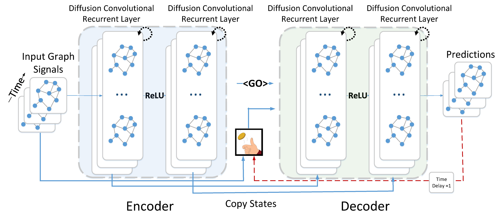

# Application of Diffusion Convolutional Recurrent Neural Network (DCRNN) on Traffic Management



This repository, a fork of [DCRNN](https://github.com/liyaguang/DCRNN), is my response to the challege of [Traffic Management](https://www.aiforsea.com/traffic-management).

## How to use?

1. Clone this repository.
2. Place the test CSV file similar to the given `training.csv` in the `input` folder.
3. Modify the open the `dcrnn_config.yaml` with a text editor such as notepad++ and set the latest_timepoint. 

To predict the demand values just after the latest timepoint in the dataset:
```
latest_timepoint:
  day_hour_min_option:
    set_day_hour_min: false
```

To set timepoint "T" to day 61 22:30, for example, to predict demand at 22:45, 23:00, 23:15, 23:30, 23:45.
```
latest_timepoint:
  day_hour_min_option:
    set_day_hour_min: true
    day: 61
    hour: 22
    min: 30
```

4. Run `dcrnn_main.py`.


## How to train the model?

Open `dcrnn_config.yaml` and set `test_only` to false. 


## Why the methodology was chosen?

The DCRNN methodology use both time-series and spatial dependency (relationship between geohash locations) to forecast future values.

## Change in this fork

- Refactor.
- Integrate separate modules into a single module.
- Adapt preprocessing and postprocessing to the data at [Traffic Management](https://www.aiforsea.com/traffic-management). Compute the distances between geohash locations and generate adjacency matrix (1 for itself, 0 for far locations.)
- Reduced dimension of the feature sequence (named "seq reducing" in the config file). Redue sequence of 14 days or 1344 (14*24*4) slots of 15 minutes to 28 slots of variable duration (8 slots of 15 min, 12 slots of 2 hours, 7 slots of 1 day, and the rest). (The original version used only 12 slots.) 
- Sample 48 timeslots (4 x 12 slots of 15 mins: 3 hours just before "T", 3+3 hours 1 week prior to "T", and the first 3 hours in the historical 2 weeks) from the historical sequence of 2 weeks (1344 slots of 15 minutes).
- Linear cosine decay of learning rate.


## Requirements with tested versions
- Python>=3.5.3
- scipy>=1.3.0
- numpy>=1.16.4
- pandas>=0.24.2
- pyyaml>=3.13
- tensorflow>=1.13.0
- geopy>=1.20.0
- python-geohash>=0.8.5

Dependency can be installed using the following command:
```bash
pip install -r requirements.txt
```

## Reference
- DCRNN (https://github.com/liyaguang/DCRNN)\
- Yaguang Li, Rose Yu, Cyrus Shahabi, Yan Liu, [Diffusion Convolutional Recurrent Neural Network: Data-Driven Traffic Forecasting](https://arxiv.org/abs/1707.01926), ICLR 2018.
- Linear Cosine Decay (https://www.tensorflow.org/api_docs/python/tf/train/linear_cosine_decay)
